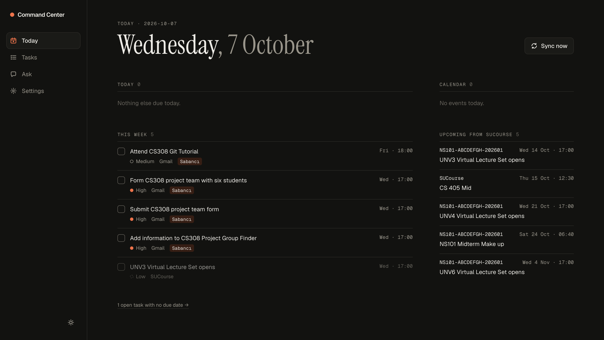
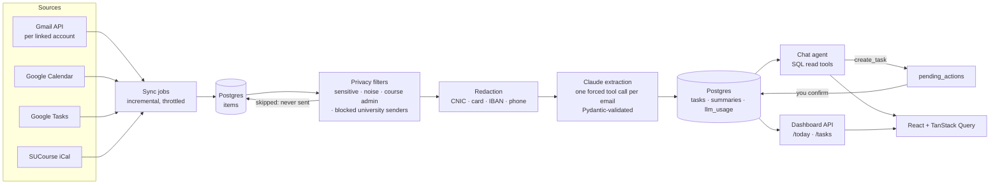

# AI Personal Command Center

A personal dashboard that pulls my Gmail (personal and university accounts), Google Calendar and SUCourse (the university's Moodle) into one Postgres database. Claude reads each new email and turns deadlines and requests into tasks. A chat agent answers questions like *"What do I need to finish before Friday?"* from that data.

▶️ **[Watch the demo video](https://youtu.be/gJMrLY4TQ4Y)**

**Why I built it.** As a student, my deadlines are spread across course announcements, career-center emails, internship recruiters, calendar invites and Moodle. I wanted one list that fills itself, and I wanted to learn how to build an LLM feature properly: structured output, evals, cost control and privacy, not just a prompt.



## What it does

- **Syncs** Gmail (every linked Google account), Google Calendar (next 60 days), Google Tasks and the SUCourse iCal feed. Gmail syncs incrementally from the saved `historyId`. Incomplete Google Tasks become tasks here and are closed when you complete them in Google.
- **Extracts tasks** from emails with Claude. Each email is one forced tool call that returns validated JSON: actionable or not, tasks with due dates and priority, a one-sentence summary, and which open tasks the email duplicates or completes.
- **Today page** shows overdue, due today and this week, plus today's events, events in the next 7 days and the next SUCourse deadlines.
- **Chat agent** ("Ask") answers questions about tasks, events and emails. It can propose a new task, but nothing is written until you confirm it.
- **Background sync** runs every 30 minutes (optional).

## Architecture



**Stack:** FastAPI (Python 3.12, uv), PostgreSQL 17, SQLAlchemy + Alembic, Anthropic SDK (Claude Haiku 4.5), APScheduler, React + Vite + TypeScript + Tailwind v4 + TanStack Query.

## Key design decisions

**SQL-first agent.** The agent's tools (`list_tasks`, `list_events`, `search_items`) are plain SQL queries with typed, validated inputs. They return small JSON rows and never email bodies. For "what's due before Friday", a date filter is exact; vector search would only add guessing. The agent loop is written by hand, with at most 5 model calls per question.

**Confirm before write.** The agent can only *propose* a task. `create_task` saves a row in `pending_actions`, and the task is created only when you press Confirm (`POST /actions/{id}/confirm`). The model can read, but it can't change your data on its own.

**Privacy filters and redaction before any LLM call.**
- Emails whose subject or sender matches `SENSITIVE_PATTERNS` (OTPs, passwords, bank alerts) or `NOISE_SENDERS` are marked skipped and never sent to Claude.
- Everything that is sent first goes through a redactor. It masks national ID numbers (CNIC), card numbers (Luhn-checked), IBANs (mod-97-checked) and phone numbers.
- The prompt forbids codes, passwords, account numbers and amounts in titles and summaries.
- The agent's search hides the same emails, including ones not yet processed.

**University blocklist.** I'm a Learning Assistant, so my university inbox contains other students' information. On that account:
- emails mentioning the course (NS101, recitation, worksheet, LA) are skipped;
- senders I block in Settings are skipped, and blocking also closes their open tasks;
- the sender list is only shown in the UI and never sent to Claude.

A dry-run command (`python -m app.sync.dryrun`) shows what each filter would skip, as counts only, before a new account's first real sync.

**Cost caps.**
- Every Claude call is logged to `llm_usage` with cache tokens and priced from a table in code.
- A sync extracts at most 50 emails.
- A newly linked account's first sync looks back only 14 days, and its first extraction stops before an estimated $0.30.
- One-off scripts take a `--max-cost` cap.
- When the API key runs out of credit, extraction stops cleanly and the UI shows a banner, instead of marking every email as failed.

**Prompt caching.** The extraction tool definition and system prompt (~3.7K tokens), plus the "today + open tasks" block, are marked `cache_control`, so later emails in a run read them from the cache. Haiku 4.5 only caches prefixes of 4,096+ tokens, so this pays off once there are about 14+ open tasks. Below that the markers cost nothing.

**Time-zone math in Python, not in the prompt.** Up to v3 the model converted times like "4:15pm PKT" to Istanbul time itself, and one of four due times in the eval was off by more than an hour. Since prompt v4, the model copies the clock time and the UTC offset exactly as the email states them, and Pydantic converts to Europe/Istanbul. After that change, 4 of 4 due times were within an hour (see below). Relative dates ("this Friday") are resolved against the email's *sent* time, not the time it was read.

**Small, testable pieces.** Queries live in small helpers so grouping and scoring can be tested without a database. The schema changes only through Alembic migrations, and the migration tests run real migrations on a throwaway Postgres database. There are 223 backend tests (`uv run pytest`).

## Evaluation

The extraction eval (`backend/evals/`) uses emails from my own inbox that I labeled by hand on a dev-only labeling page. The page never shows the model's answer, so the labels aren't nudged by it.

Each email is extracted as if read at its sent time, with no open tasks. Titles match by word overlap (F1 ≥ 0.5), with no LLM judge, so scoring is free and gives the same answer every time.

The labeled emails are never committed. Reports contain only metrics and counts per kind of mistake.

**Tuning set**: 59–60 emails, 8 of them actionable. Model: `claude-haiku-4-5-20251001`.

| Prompt | Actionable accuracy | Actionable precision | Task recall | Task precision | Due date (same day) | Due time (±1 h) |
| --- | --- | --- | --- | --- | --- | --- |
| v1 | 82% (49/60) | 42% (8/19) | 100% (7/7) | 37% (7/19) | 100% (7/7) | 50% (2/4) |
| v2: spell out what is not actionable | 92% (55/60) | 62% (8/13) | 100% (7/7) | 54% (7/13) | 100% (7/7) | 75% (3/4) |
| v3: time zones, account changes, test-prep marketing | 93% (55/59) | 67% (8/12) | 100% (8/8) | 67% (8/12) | 100% (8/8) | 75% (3/4) |
| v4: keep the email's zone, convert in Python | 93% (55/59) | 67% (8/12) | 100% (8/8) | 67% (8/12) | 100% (8/8) | **100% (4/4)** |

Actionable recall was 100% in every version. The v1 row uses labels after I fixed a few of my own labeling mistakes; I also fixed a few labels between v2 and v3. Each version was compared against a re-run of the previous prompt on the same labels (reports in `backend/evals/results/`).

**Held-out test set** (25 emails never used for tuning, picked without any model output, run once on v4): actionable accuracy **92% (23/25)**, with 2 false "actionable" calls.

**Honest limitations of these numbers:**
- **The held-out set has no actionable emails.** Every email that produced a task in my inbox was already in the tuning set, so the held-out result only measures false positives. It says nothing about recall or due dates on unseen emails.
- **The tuning set is small:** 8 actionable emails, so one email moves precision by about 8 points. v3 and v4 differ by one due time.
- **The prompt was tuned on these emails,** so tuning-set scores are optimistic.
- **Results vary between runs:** Claude samples at its default temperature, so two runs can differ by an email or two.
- **Word-overlap matching** can miss a correct task that's worded very differently.

## Costs

Real usage with Claude Haiku 4.5, estimated from logged tokens:

| What | Calls | Cost |
| --- | --- | --- |
| Extraction, ~800 emails synced (257 skipped by filters, never sent) | 574 | $2.22 (≈ $0.004 per email) |
| Chat agent questions | 15 | $0.03 (≈ $0.002 per question) |
| One eval run on 60 emails | 60 | ≈ $0.30 |
| Held-out eval run on 25 emails | 25 | $0.14 |

Day to day, a sync that reads 20 new emails costs about 8 cents.

## Setup

Requirements: macOS or Linux, [uv](https://docs.astral.sh/uv/), PostgreSQL 17 with the pgvector extension, Node 22 (`.nvmrc`), an Anthropic API key and a Google Cloud project.

1. **Google OAuth.** In Google Cloud Console, enable the Gmail API, Google Calendar API and Google Tasks API. Create an OAuth client of type *Web application* with redirect URI `http://localhost:8000/auth/google/callback`. Keep the consent screen in *Testing* mode and add your Google accounts as test users. Scopes: `gmail.readonly`, `calendar.readonly`, `tasks.readonly`, `openid`, `userinfo.email`.
2. **Database.**
   ```sh
   brew install postgresql@17 pgvector && brew services start postgresql@17
   createdb command_center && psql command_center -c "CREATE EXTENSION vector"
   ```
3. **Backend.**
   ```sh
   cd backend
   cp .env.example .env   # fill in the keys; generate TOKEN_ENCRYPTION_KEY as the file explains
   uv sync
   uv run alembic upgrade head
   uv run uvicorn app.main:app --reload
   ```
4. **Frontend.**
   ```sh
   cd frontend && nvm use && npm install && npm run dev
   ```
5. Open <http://localhost:5173>, sign in with Google and press **Sync now**. To add SUCourse, save your Moodle calendar export URL with `POST /sync/sucourse/url`. To add another Google account, use **Settings → Link another Google account**.

Run one uvicorn worker only: each worker would start its own background job.

## Known limitations

- **Built for one person.** OAuth stays in Testing mode, the time zone is Europe/Istanbul throughout, and the filters and university rules are tuned to my own inboxes.
- **Pattern-based privacy filters and redaction.** Regexes can miss a sensitive email whose subject looks harmless, and the course-admin keywords can't catch every message that mentions a student. The blocklist is the backstop, but it only works after the first sync shows who the senders are.
- **No semantic search yet.** The database has a pgvector column and the plan was nomic-embed-text embeddings via Ollama, but search is still SQL `ILIKE`. That's fine for names and course codes, weak for paraphrases.
- **Slow first sync.** The Gmail API quota on this Cloud project is low (~550 units per user per minute), so the first sync of an account takes a few minutes.
- **Old deadlines.** Extraction uses the time it runs as "today". Backfilled old emails rarely produce tasks, because their deadlines have passed.
- **Small eval:** see above.

## Repository layout

```
backend/
  app/auth/        Google OAuth, linked accounts, university sender blocklist
  app/sync/        Gmail, Calendar, SUCourse sync; runner, scheduler, backfill, dry run
  app/llm/         extraction, redaction, chat agent, pricing, Claude client
  app/dashboard/   /today and /tasks
  evals/           export, labeling endpoints, runner, scoring, metrics-only reports
  alembic/         migrations
  tests/
frontend/src/      React pages (Today, Tasks, Ask, Settings, Label)
```
